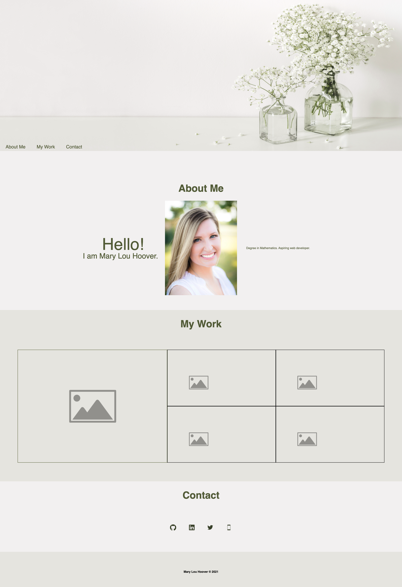

# ML_Portfolio

## About my Portfolio

1. Nav bar links are located in the header section and formatted to fit in the banner; all of the links work to direct the user quickly to the 'About Me', 'My Work', 'Contact' and 'Resume' sections of the website.

2. The 'My Work' section showcases & links to a group project and 2 past work assignments. 

3. The 'Contact' area contains live links to my GitHub, Linkedin, Twitter, and Phone Number. 

## Final Result Screenshot

## Deployed Websites
- [GitHub Pages Link](https://mlh19.github.io/ML_Portfolio/)

## Other Details

- Completed this assignment independently.

- This portfolio is 2 of 4 updates. 

